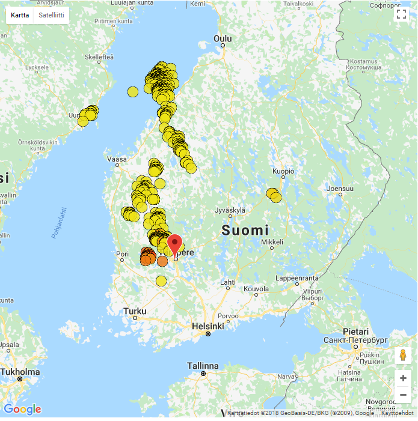

<h1>Weatherwidget</h1>

Fetching observations and forecasts from fmi's api and doing something nice with them. 
Right now app only uses data from lightning strikes and shows them on the map.

Screenshot from ligthings-view below 
</img>
 
Map shows lightning strikes from last 12h. Data is from FMI (Finnish Meteorological Institute), so only strikes near Finland are shown.
Color of the strike indicates how long age it happened. In one hour color fades from red to yellow. More than hour old strikes are yellow.

<a target="_blank" rel="noopener noreferrer" href="https://napuu.xyz:1443/fetch">Live-demo</a> (browser will warn about SSL certificate since it's self-signed)

